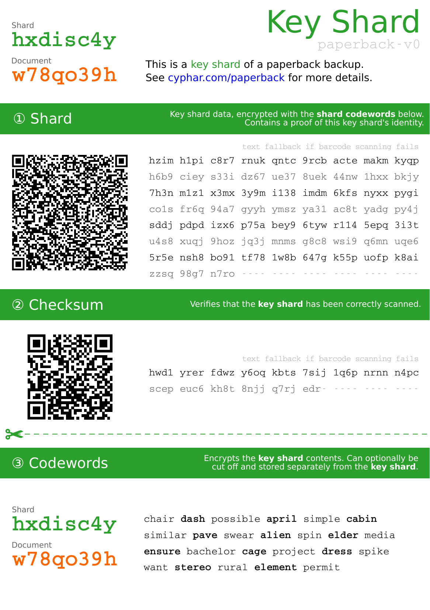

## paperback ##

**NOTE**: This project is still a work-in-progress.

`paperback` is a paper-based backup scheme that is secure and easy-to-use.
Backups are encrypted, and the secret key is split into numerous "key shards"
which can be stored separately (by different individuals), removing the need
for any individual to memorise a secret passphrase.

This system can also be used as a digital will, because the original creator of
the backup is not required to be present (or consent to) the decryption of the
backup if enough of the "key shards" are collected. No individual knows the
secret key (not even you), and thus no party can be compelled to provide the
key without the consent of `k-1` other parties.

To make this system as simple-to-use as possible, `paperback` creates several
PDFs which you can then print out and laminate, ready for recovery. The mockup
layout of these document is given below.

|                      Main Document                       |                   Key Shard                      |
| :------------------------------------------------------: | :----------------------------------------------: |
|  |  |

These "key shards" can then be given to a set of semi-trusted people.
`paperback` also supports `(k, n)` redundancy, allowing for `n` key shards to
be created but only `k` being required in order for the backup to be recovered.

"Semi-trusted" in this context means that you must be sure of the following two
statements about the parties you've given pieces to:

1. At any time, at least `k` of the parties you've given pieces to will provide
   you with the data you gave them. This is important to consider, as human
   relationships can change over time, and your friend today may not be your
   friend tomorrow.

2. At any time, no party will maliciously collude with more than `k-1` other
   parties in order to decrypt your backup information (however if you are
   incapacitated, you could organise with the parties to cooperate only in that
   instance).  Shamir called this having a group of "mutually suspicious
   individuals with conflicting interests". Ideally each of the parties will be
   unaware of each other (or how many parties there are), and would only come
   forward based on pre-arranged agreements with you. In practice a person's
   social graph is quite interconnected, so a higher level of trust is
   required.

Each party will get a copy of their unique "key shard", and optionally a copy
of the "master document" (though this is not necessary, and in some situations
you might want to store it separately so that even if the parties collude they
cannot use the "master key" as they do not have the "master document"). We
recommend laminating all of the relevant documents, and printing them duplex
(with each page containing the same page on both sides).

A full description of the cryptographic design and threat model is provided [in
the included design document][design].

[design]: DESIGN.md

### Paper Choices and Storage ###

One of the most important things when considering using `paperback` is to keep
in mind that the integrity of the backup is only as good as the paper you print
it on. Most "cheap" copy paper contains some levels of acid (either from
processing or from the lignin in wood pulp), and thus after a few years will
begin to yellow and become brittle. Archival paper is a grade of paper that is
designed to last longer than ordinary copy paper, and has standardised
requirements for acidity levels and so on. The [National Archives of
Australia][naa-standard] have an even more stringent standard for Archival
paper and will certify consumer-level archival paper if it meets their strict
requirements. Though archival paper is quite a bit more expensive than copy
paper, you can consider it a fairly minor cost (as most users won't need more
than 50 sheets). If archival paper is too expensive, try to find alkaline or
acid-free paper (you can ask your state or local library if they have any
recommendations).

In addition, while using **hot** lamination on a piece of paper may make the
document more resistant to spills and everyday damage, [the lamination process
can cause documents to deteriorate faster][anthropology-lamination] due to the
material most lamination pouches are made from (not to mention that the process
is fairly hard to reverse).  Encapsulation is a process similar to lamination,
except that the laminate is usually made of more inert materials like BoPET
(Mylar) and only the edges are sealed with tape or thread (allowing the
document to be removed). Archival-grade polyester sleeves are more expensive
than lamination pouches, though they are not generally prohibitively expensive
(you can find ~AU$1 sleeves online).

The required lifetime of a `paperback` backup is entire up to the user, and so
making the right price-versus-longevity tradeoff is fairly personal. However,
if you would like your backups to last indefinitely, I would recommend looking
at the [National Archives of Australia's website][naa-preserving-paper] which
documents in quite some detail what common mistakes are made when trying to
preserve paper documents.

It is recommended that you explain some of the best practices of storing
backups to the people you've given shard backups to -- as they are the people
who are in charge of keeping your backups safe and intact.

[naa-standard]: https://web.archive.org/web/20180304061138/https://www.naa.gov.au/information-management/managing-information-and-records/preserving/physical-records-pres/archival-quality-paper-products.aspx
[anthropology-lamination]: https://web.archive.org/web/20181128202230/http://anthropology.si.edu/conservation/lamination/lamination_guidelines.htm
[naa-preserving-paper]: https://web.archive.org/web/20180324131805/http://www.naa.gov.au/information-management/managing-information-and-records/preserving/artworks.aspx

### License ###

`paperback` is licensed under the terms of the GNU GPLv3+.

```
paperback: resilient paper backups for the very paranoid
Copyright (C) 2018-2020 Aleksa Sarai <cyphar@cyphar.com>

This program is free software: you can redistribute it and/or modify
it under the terms of the GNU General Public License as published by
the Free Software Foundation, either version 3 of the License, or
(at your option) any later version.

This program is distributed in the hope that it will be useful,
but WITHOUT ANY WARRANTY; without even the implied warranty of
MERCHANTABILITY or FITNESS FOR A PARTICULAR PURPOSE.  See the
GNU General Public License for more details.

You should have received a copy of the GNU General Public License
along with this program.  If not, see <https://www.gnu.org/licenses/>.
```
